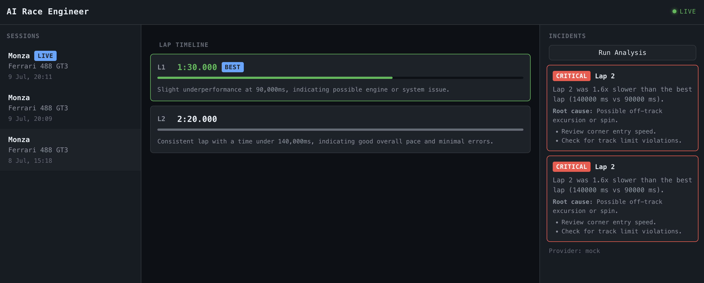

# AI Race Engineer Platform


Real-time AI race engineer that reads telemetry from the **Assetto Corsa** simulator, analyzes driver performance with a provider-agnostic AI layer, and surfaces insights on a live React dashboard — deployed to AWS EKS with full observability.

> This is a learning/portfolio project. It demonstrates a full-stack application with real-time data processing, AI integration, cloud-native deployment, and production observability. It requires specific tools and configuration to run.

---

## Dashboard

<p align="center">
  
</p>

Dark-themed three-panel racing monitor: session sidebar with LIVE indicator, lap timeline with proportional time bars and best-lap highlighting, and an incident panel with AI-powered root cause analysis.

---

## Architecture

```
Windows PC                         Mac (dev) / AWS
─────────────────                  ──────────────────────────────────────
Assetto Corsa                      FastAPI backend  (REST + WebSocket + /metrics)
  + Python telemetry agent    →    PostgreSQL (RDS in prod)
  (Shared Memory API)              AI adapter layer (Claude / OpenAI / Ollama / Mock)
                                   React live dashboard (dark racing theme, WebSocket)
                                        ↓
                                   AWS EKS  (Terraform, Helm, shared ALB)
                                   Prometheus + Grafana + Loki
```

The telemetry agent runs on a Windows PC alongside the simulator. It reads shared memory and POSTs lap data to the backend over LAN. The backend analyzes each lap with the configured AI provider, stores results in PostgreSQL, and broadcasts them to all connected dashboard clients via WebSocket.

---

## Features

- **Real-time telemetry** — Assetto Corsa Shared Memory API reader streams lap data to the backend
- **Provider-agnostic AI** — switchable between Claude, OpenAI, Ollama (local), and Mock via a single env var
- **WebSocket live dashboard** — laps and incidents appear instantly; auto-reconnect with exponential backoff
- **AI Incident Analyst** — detects performance anomalies and provides root cause analysis with severity levels
- **Full offline mode** — Ollama local LLM, no internet required after initial model pull
- **Docker Compose local dev** — one command brings up the full stack (db + backend + frontend)
- **AWS EKS production deploy** — Terraform + Helm, shared ALB (Ingress Group), EKS Pod Identity
- **CI/CD pipeline** — GitHub Actions: lint + test + build (CI), ECR push + helm upgrade (CD)
- **Cloud-native observability** — Prometheus metrics, Grafana dashboards, Loki log aggregation, 5xx alerting
- **Remote Terraform state** — S3 + DynamoDB locking, bootstrap config for the chicken-and-egg problem

---

## Built With

[![Python][Python]][Python-url]
[![FastAPI][FastAPI]][FastAPI-url]
[![React][React]][React-url]
[![TypeScript][TypeScript]][TypeScript-url]
[![PostgreSQL][PostgreSQL]][PostgreSQL-url]
[![Docker][Docker]][Docker-url]
[![Terraform][Terraform]][Terraform-url]
[![AWS][AWS]][AWS-url]
[![Kubernetes][Kubernetes]][Kubernetes-url]
[![Helm][Helm]][Helm-url]
[![Amazon EKS][EKS]][EKS-url]
[![Amazon RDS][RDS]][RDS-url]
[![Amazon ECR][ECR]][ECR-url]
[![Prometheus][Prometheus]][Prometheus-url]
[![Grafana][Grafana]][Grafana-url]
[![Vite][Vite]][Vite-url]
[![GitHub Actions][GHA]][GHA-url]
[![Ollama][Ollama]][Ollama-url]

---

## Tech Stack

| Layer | Technology |
|---|---|
| Simulator | Assetto Corsa (Shared Memory API) |
| Telemetry agent | Python 3.13 |
| Backend API | FastAPI + WebSocket |
| Database | PostgreSQL (AWS RDS in production) |
| AI adapter | Provider-agnostic Python layer |
| AI providers | Claude API, OpenAI API, Ollama (local), MockProvider |
| Frontend | React (Vite + TypeScript) |
| Containerization | Docker, Docker Compose |
| CI/CD | GitHub Actions |
| Cloud | AWS (EKS, RDS, ECR, S3, Secrets Manager) |
| IaC | Terraform (remote S3 state) |
| Observability | Prometheus, Grafana, Loki, Promtail |

---

## Prerequisites

```bash
# Required tools and minimum versions
python3 --version      # >= 3.11
node --version         # >= 20
docker --version       # Docker Desktop running
terraform --version    # >= 1.5
helm version           # v3+
kubectl version        # latest
aws --version          # AWS CLI v2
```

Install on Mac:
```bash
brew install python node terraform helm kubectl awscli
```

Docker Desktop: https://www.docker.com/products/docker-desktop/

> Docker Desktop must be **running** before using Docker Compose or `make apply`.

---

## Quick Start

### Mode 1: Local development (Docker Compose)

```bash
# 1. Clone and configure
git clone https://github.com/TamasVasenszki/ai-race-engineer-platform.git
cd ai-race-engineer-platform
cp .env.example .env

# 2. Start the full stack (db + backend + frontend)
docker compose up

# 3. Open the dashboard
open http://localhost:5173
```

Backend on `:8000` (`/health`, `/metrics`), frontend on `:5173`. Uses the Mock AI provider by default — no API key needed.

### Mode 2: Live simulator (Mac + Windows LAN)

```bash
# 1. Start backend + dashboard on Mac (same as above)
docker compose up

# 2. On the Windows PC with Assetto Corsa:
#    - Install Python 3.11+
#    - pip install httpx
#    - Start Assetto Corsa, enter a track
#    - Run the agent (point it at your Mac's LAN IP):
python telemetry-agent/agent.py --backend http://<mac-ip>:8000

# 3. Laps appear in real-time on the Mac dashboard via WebSocket
```

### Mode 3: Offline (Ollama local LLM)

```bash
# 1. Set AI provider in .env
#    AI_PROVIDER=ollama
#    OLLAMA_MODEL=llama3.2

# 2. Start all services including Ollama
docker compose --profile ollama up

# 3. First run only — pull the model (requires internet once)
docker exec -it ai-race-engineer-platform-ollama-1 ollama pull llama3.2

# 4. Verify
curl http://localhost:8000/health
# → {"status":"ok","ai_provider":"ollama","ollama_status":"ok"}
```

After the model is pulled, the platform works fully offline. ~4 GB disk for the default model.

### Mode 4: AWS production (EKS)

```bash
# 1. Bootstrap remote state (one-time)
cd infra/terraform/bootstrap && terraform init && terraform apply

# 2. Deploy the full stack
cd ../../..
make apply       # terraform → kubeconfig → image push → LBC → CSI → backend + frontend charts

# 3. Observability (optional)
make monitoring  # kube-prometheus-stack + ServiceMonitor + dashboard + alert rules
make logging     # Loki + Promtail + logs dashboard
make grafana     # port-forward Grafana to http://localhost:3000

# 4. Tear down
make destroy     # ordered teardown: helm uninstall → ALB drain → SG cleanup → terraform destroy
```

`make apply` is auto-approved. `make destroy` asks for confirmation (`AUTO_APPROVE=1` skips).

---

## API Endpoints

| Method | Endpoint | Description |
|--------|----------|-------------|
| GET | `/health` | App status + AI provider info |
| POST | `/laps/` | Submit a lap (broadcasts `new_lap` via WebSocket) |
| GET | `/laps/{id}` | Get a single lap with AI analysis |
| POST | `/sessions/` | Create a new racing session |
| GET | `/sessions/` | List all sessions |
| GET | `/sessions/{id}` | Get a single session |
| GET | `/sessions/{id}/laps` | List laps for a session (ordered by lap number) |
| POST | `/sessions/{id}/incidents` | Run AI incident analysis (broadcasts `incident_alert` via WebSocket) |
| WebSocket | `/ws` | Real-time broadcast of new laps and incident alerts |
| GET | `/metrics` | Prometheus metrics |

---

## Project Structure

```
ai-race-engineer-platform/
├── telemetry-agent/             # Python agent — Assetto Corsa Shared Memory reader
├── backend/                     # FastAPI REST + WebSocket API
│   ├── routers/                 # Route handlers split by module
│   ├── ai/                      # AI adapter layer
│   │   ├── base.py              # Abstract AIProvider interface
│   │   ├── claude.py            # ClaudeProvider (forced tool use)
│   │   ├── openai.py            # OpenAIProvider
│   │   ├── ollama.py            # OllamaProvider (local, free)
│   │   └── mock.py              # MockProvider (no API key needed)
│   ├── schemas/                 # Pydantic v2 request/response models
│   └── ws.py                    # WebSocket ConnectionManager
├── frontend/                    # React (Vite + TypeScript) live dashboard
│   ├── src/components/          # Layout, SessionSidebar, LapTimeline, IncidentPanel
│   ├── src/hooks/               # useWebSocket, useSessions, useSessionLaps
│   ├── src/context/             # WebSocketContext provider
│   └── src/types/               # Lap, Session, Incident, WsMessage interfaces
├── infra/
│   ├── terraform/               # VPC, EKS, RDS, ECR, IAM, Secrets Manager (modular)
│   │   └── bootstrap/           # S3 + DynamoDB for remote state (one-time)
│   └── k8s/
│       ├── backend/             # Backend Helm chart (+ SecretProviderClass, Pod Identity)
│       └── frontend/            # Frontend Helm chart (shared ALB via Ingress Group)
├── monitoring/                  # Prometheus/Grafana values, Loki/Promtail, dashboards, alerts
├── .github/workflows/
│   ├── ci.yml                   # Lint + test + build (on push/PR to main)
│   └── cd.yml                   # ECR push + helm upgrade (on merge to main)
├── Makefile                     # EKS lifecycle: make apply / make destroy
├── docker-compose.yml           # Local dev: db + backend + frontend (+ ollama profile)
└── CLAUDE.md                    # Detailed project state and development log
```

---

## Security

- No API keys, `.env` files, or AWS credentials in code — `.env.example` for documentation only
- **Secrets Manager** for database URL and AI API keys on EKS
- **EKS Pod Identity** for keyless AWS access from pods (no IRSA, no static credentials)
- **Secrets Store CSI driver** syncs Secrets Manager values into native Kubernetes Secrets
- **GitHub OIDC** for CD pipeline — no long-lived AWS keys in repo secrets
- **Least privilege IAM** — backend role reads only its own secrets; CD role scoped to ECR + EKS
- RDS in private subnets, no public access
- ECR image scanning on push
- Alpine-based Docker images (minimal attack surface)

<!-- Badge references -->

[Python]: https://img.shields.io/badge/Python-3776AB?style=for-the-badge&logo=python&logoColor=white
[Python-url]: https://www.python.org/

[FastAPI]: https://img.shields.io/badge/FastAPI-009688?style=for-the-badge&logo=fastapi&logoColor=white
[FastAPI-url]: https://fastapi.tiangolo.com/

[React]: https://img.shields.io/badge/React-61DAFB?style=for-the-badge&logo=react&logoColor=black
[React-url]: https://react.dev/

[TypeScript]: https://img.shields.io/badge/TypeScript-3178C6?style=for-the-badge&logo=typescript&logoColor=white
[TypeScript-url]: https://www.typescriptlang.org/

[PostgreSQL]: https://img.shields.io/badge/PostgreSQL-4169E1?style=for-the-badge&logo=postgresql&logoColor=white
[PostgreSQL-url]: https://www.postgresql.org/

[Docker]: https://img.shields.io/badge/Docker-2496ED?style=for-the-badge&logo=docker&logoColor=white
[Docker-url]: https://www.docker.com/

[Terraform]: https://img.shields.io/badge/Terraform-844FBA?style=for-the-badge&logo=terraform&logoColor=white
[Terraform-url]: https://www.terraform.io/

[AWS]: https://img.shields.io/badge/AWS-232F3E?style=for-the-badge&logo=amazonwebservices&logoColor=white
[AWS-url]: https://aws.amazon.com/

[Kubernetes]: https://img.shields.io/badge/Kubernetes-326CE5?style=for-the-badge&logo=kubernetes&logoColor=white
[Kubernetes-url]: https://kubernetes.io/

[Helm]: https://img.shields.io/badge/Helm-0F1689?style=for-the-badge&logo=helm&logoColor=white
[Helm-url]: https://helm.sh/

[EKS]: https://img.shields.io/badge/Amazon_EKS-FF9900?style=for-the-badge&logo=amazoneks&logoColor=white
[EKS-url]: https://aws.amazon.com/eks/

[RDS]: https://img.shields.io/badge/Amazon_RDS-527FFF?style=for-the-badge&logo=amazonrds&logoColor=white
[RDS-url]: https://aws.amazon.com/rds/

[ECR]: https://img.shields.io/badge/Amazon_ECR-FF9900?style=for-the-badge&logo=amazonaws&logoColor=white
[ECR-url]: https://aws.amazon.com/ecr/

[Prometheus]: https://img.shields.io/badge/Prometheus-E6522C?style=for-the-badge&logo=prometheus&logoColor=white
[Prometheus-url]: https://prometheus.io/

[Grafana]: https://img.shields.io/badge/Grafana-F46800?style=for-the-badge&logo=grafana&logoColor=white
[Grafana-url]: https://grafana.com/

[Vite]: https://img.shields.io/badge/Vite-646CFF?style=for-the-badge&logo=vite&logoColor=white
[Vite-url]: https://vite.dev/

[GHA]: https://img.shields.io/badge/GitHub_Actions-2088FF?style=for-the-badge&logo=githubactions&logoColor=white
[GHA-url]: https://github.com/features/actions

[Ollama]: https://img.shields.io/badge/Ollama-000000?style=for-the-badge&logo=ollama&logoColor=white
[Ollama-url]: https://ollama.com/
